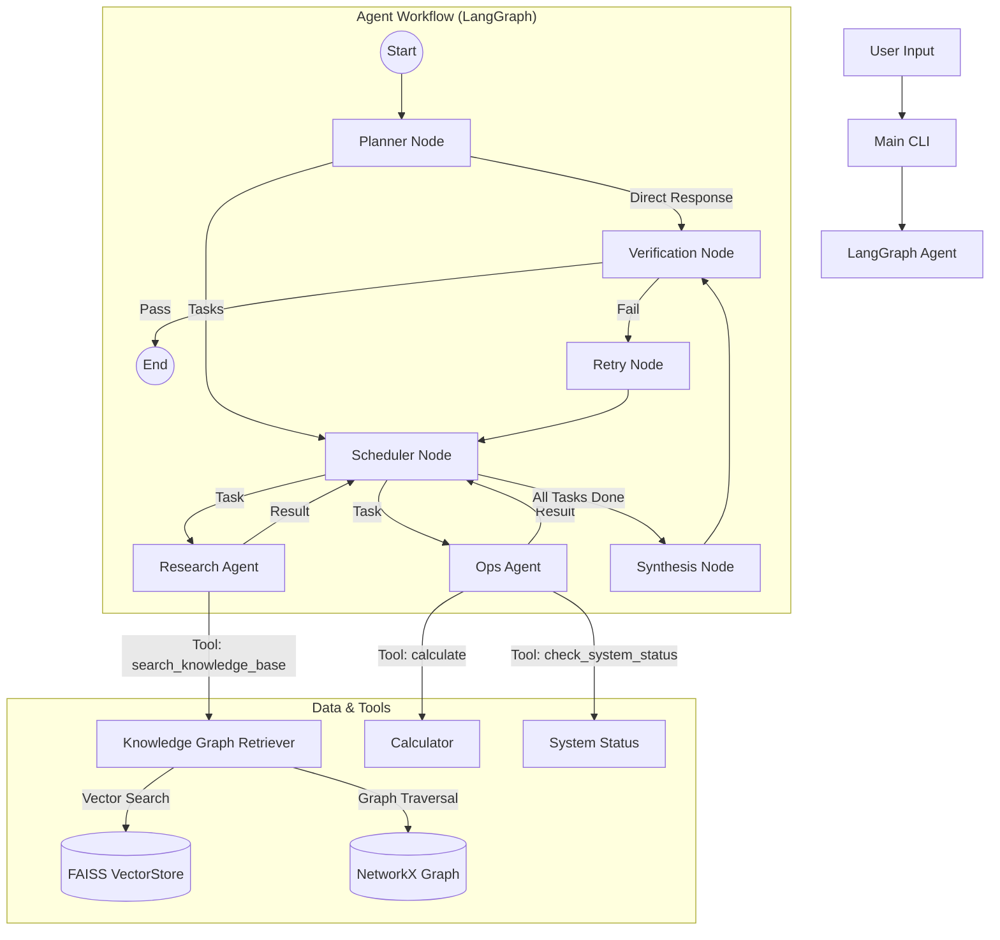

# Mini Agentic RAG System

A production-ready, graph-based RAG (Retrieval-Augmented Generation) system powered by **LangGraph** and **Gemini**. This system features a multi-agent architecture capable of complex reasoning, multi-step planning, and hybrid retrieval (Vector + Knowledge Graph).

## 🏗️ Architecture

The system uses a **Supervisor-Worker** pattern implemented with LangGraph.



### Key Components

1.  **Planner Node**: Analyzes the user request and breaks it down into granular tasks with dependencies.
2.  **Scheduler Node**: Manages task execution, handling dependencies and routing tasks to the appropriate workers.
3.  **Research Agent**: Specialized worker for information retrieval using the Knowledge Graph.
4.  **Ops Agent**: Specialized worker for calculations and system status checks.
5.  **Knowledge Graph Retriever**: A hybrid retriever that uses:
    *   **Vector Search (FAISS)**: To find relevant entry points in the graph.
    *   **Graph Traversal (NetworkX)**: To explore connected concepts (1-hop neighbors) for richer context.
6.  **Verification Node**: Audits the final answer against the retrieved context to prevent hallucinations.
7.  **Retry Node**: Provides feedback and triggers a retry if verification fails.

## 🧠 Design Decisions

*   **LangGraph for Orchestration**: Chosen for its ability to handle cyclic graphs, state persistence, and complex control flow (loops, conditional branching), which is essential for agentic workflows.
*   **Hybrid Retrieval**: Pure vector search often misses relationships. By combining embeddings with a lightweight graph structure (linking sequential chunks and shared keywords), we get better context window expansion.
*   **Planner-Worker Pattern**: Decomposing complex queries (e.g., "Research X and then calculate Y") into discrete tasks allows for better reliability and specialized tool use.
*   **State Management**: `AgentState` tracks the plan, execution results, and conversation history, allowing the agent to resume or retry tasks intelligently.
*   **Persistence**: Uses `SqliteSaver` to persist conversation threads, enabling long-running sessions and memory.

## 🚀 How to Run

### Prerequisites
*   Python 3.10+
*   A Google Cloud API Key (for Gemini models)

### Setup

1.  **Clone the repository**
    ```bash
    git clone <repository-url>
    cd mini-agentic-rag-system
    ```

2.  **Install Dependencies**
    ```bash
    pip install -r requirements.txt
    ```

3.  **Configure Environment**
    Create a `.env` file in the root directory:
    ```bash
    GOOGLE_API_KEY=your_google_api_key_here
    ```

4.  **Ingest Data**
    Place your markdown or text documents in the `data/` directory. The system will automatically ingest them on the first run.

### Execution

Run the CLI interface:
```bash
python main.py
```

### Example: Multi-Hop Reasoning

The system excels at answering complex questions that require traversing multiple documents.

**Query:**
> "Which project is blocked by the service that caused the data leak in March 2024?"

**Agent Reasoning Trace:**
1.  **Planner**: Decomposes the query into two dependent tasks:
    *   *Task 1*: Identify the service responsible for the March 2024 data leak.
    *   *Task 2*: Find which project is blocked by that service.
2.  **Research Agent (Task 1)**: Searches for "data leak March 2024" and retrieves `post_mortem_march_2024.md`.
    *   *Result*: "Legacy-Auth-Service".
3.  **Research Agent (Task 2)**: Searches for "project blocked by Legacy-Auth-Service" and retrieves `legacy_auth_service.md` and `project_orion_roadmap.md`.
    *   *Result*: "Project Orion".
4.  **Synthesis**: Combines findings to answer: "The service responsible was Legacy-Auth-Service, which is currently blocking Project Orion."

## ⚠️ Limitations

*   **In-Memory Graph**: The current implementation uses `NetworkX`, which is entirely in-memory. This works well for small-to-medium datasets but would need to be migrated to a persistent graph database (like Neo4j) for large-scale production.
*   **Simple Graph Construction**: Edges are created based on sequential chunk order and simple keyword matching. A more advanced approach would use LLM-based entity and relation extraction during ingestion.
*   **Synchronous Execution**: While the architecture supports parallelism, the current scheduler executes tasks sequentially or in simple batches. True async execution could be optimized further.

## 🔮 Possible Production Improvements

1.  **Persistent Graph Database**: Migrate from NetworkX to **Neo4j** or **ArangoDB** to handle millions of nodes and complex graph queries.
2.  **Async Tool Execution**: Implement fully asynchronous tool calls to allow the Research and Ops agents to work in parallel when tasks are independent.
3.  **Semantic Caching**: Implement a semantic cache (e.g., GPTCache) to store and retrieve answers for frequently asked questions, reducing latency and cost.
4.  **Advanced Evaluation**: Integrate **Ragas** or **DeepEval** to programmatically measure retrieval precision/recall and generation faithfulness.
5.  **Dynamic Tool Loading**: Allow the agent to discover and load tools dynamically based on the context, rather than having a hardcoded list.
